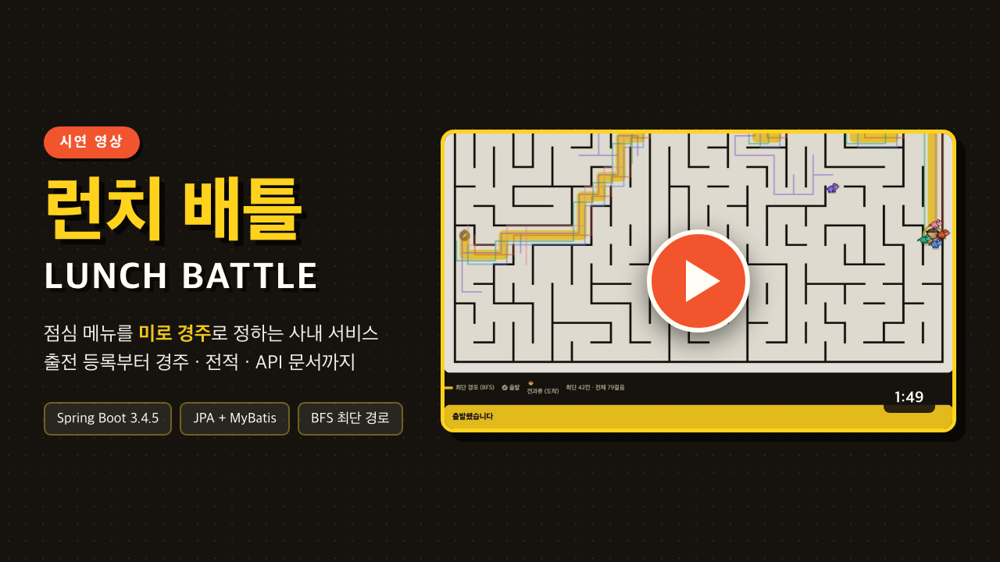
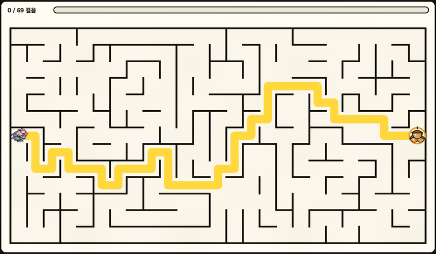
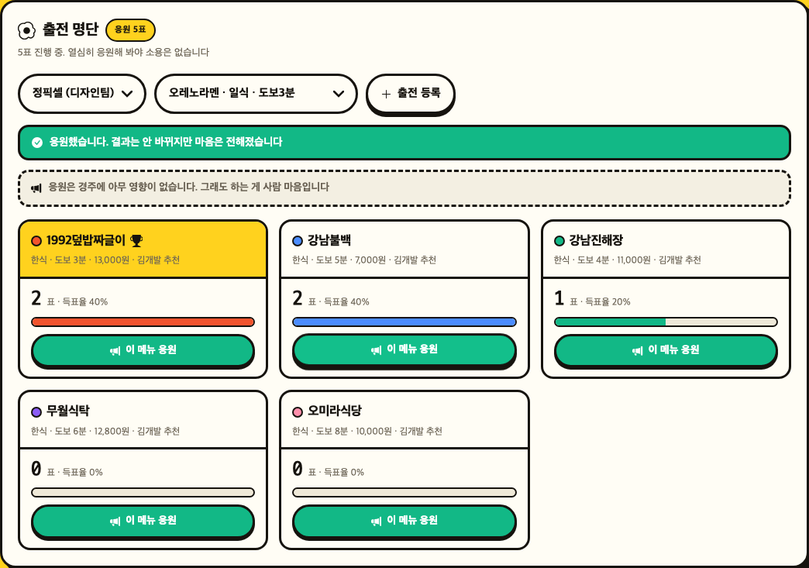
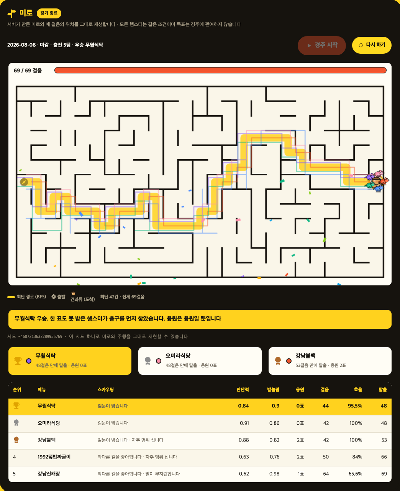
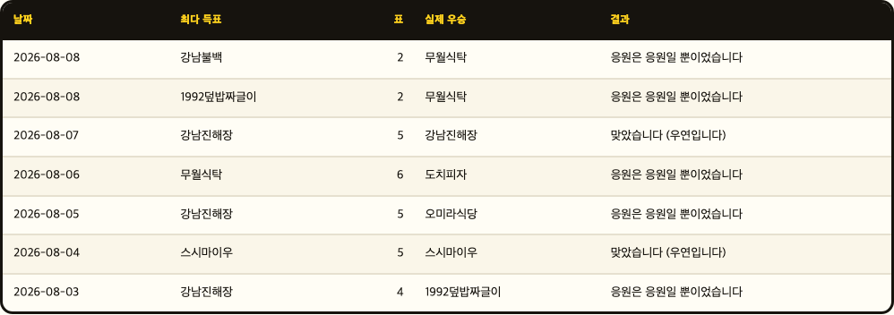
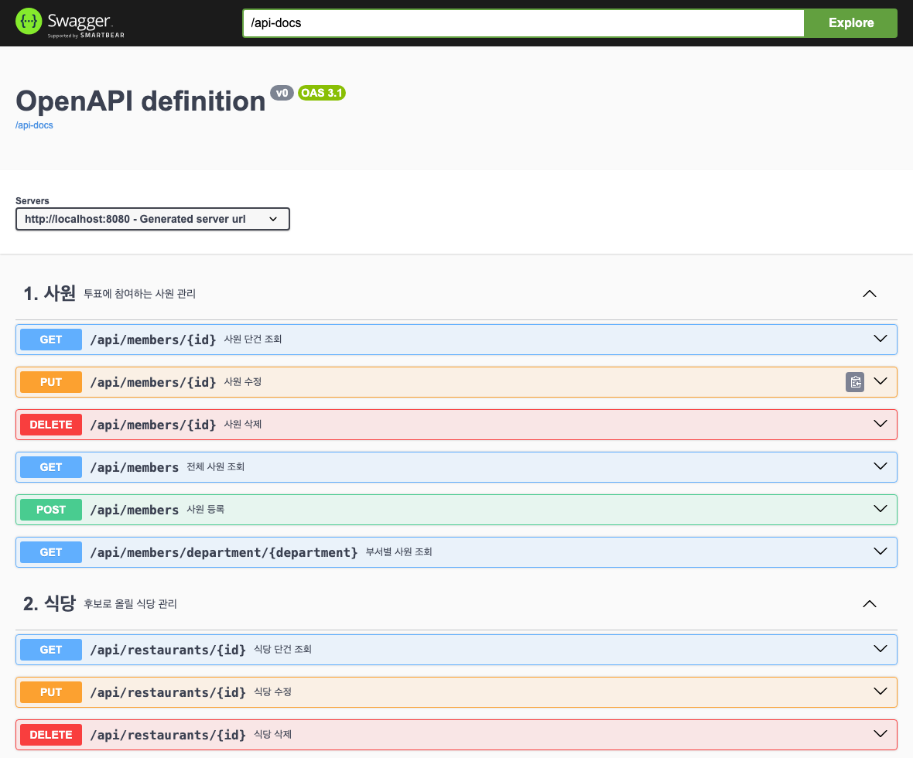

# 런치 배틀 (Lunch Battle)

점심 메뉴를 정하지 못하는 문제를 경주로 푸는 사내 서비스.
후보로 오른 메뉴마다 햄스터 한 마리가 같은 미로에 들어가고,
미로 끝의 견과류에 먼저 닿은 메뉴가 오늘의 점심이 된다.

[](https://youtu.be/G_7wqJFDAEg)

**[▶ 시연 영상 보기 (1분 49초)](https://youtu.be/G_7wqJFDAEg)** — 출전 등록과 응원 · 미로 경주 ·
결과 · 전적 기록실 · API 문서(저장된 시드 재조회) · 다시 하기

작성 : 신주용 (광주 3반, G086)

## 미로 경주



노란 길은 서버가 BFS 로 구해 둔 **최단 경로**다. 햄스터는 매 걸음 판단력만큼의 확률로
그 길을 따르고, 아니면 아무 데나 간다 — 그래서 얼마나 헤매는지가 그대로 보인다.
([원본 파일](docs/media/race.mp4))

## 개발 환경

| 구분 | 버전 |
|---|---|
| JDK | 21 (Gradle toolchain 으로 고정) |
| Spring Boot | 3.4.5 |
| Gradle | 8.5 (wrapper 포함) |
| 영속성 | Spring Data JPA (Hibernate 6.6.13) + MyBatis 3.0.4 |
| DB | H2 2.3.232 (인메모리) |
| API 문서 | springdoc-openapi 2.8.5 |
| 빌드 산출물 | 실행 가능한 단일 jar |

의존성 버전은 `build.gradle` 에 고정되어 있고, JDK 는 toolchain 으로 지정해
로컬에 설치된 자바 버전과 무관하게 21 로 빌드된다.

## 구조

계층(controller/service/repository)이 아니라 **도메인**으로 나눴다. 한 기능을 고칠 때
폴더 네 곳을 오가지 않고 한 폴더 안에서 끝나고, 도메인 간 참조가 import 로 드러나
경계가 무너지면 컴파일 시점에 보인다.

```
com.skala.lunch
├── member         사원 (5)          ─┐
├── restaurant     식당 (5)           ├ 기본 CRUD
├── review         리뷰 (5)          ─┘
├── battle         배틀·후보·투표 (13)   1인 1표, 마감, 규칙 판정
├── race           미로 경주 (7)
│   └── maze       미로 생성 + BFS 최단 경로 (1)
├── analysis       MyBatis 집계 조회 (4)
│   └── dto        집계 결과 (8)
├── audit          투표 감사 로그 — AOP 로 수집 (5)
└── global         도메인에 속하지 않는 공통
    ├── aop        실행시간 측정 (1)
    └── error      예외 + 전역 처리기 (5)
```

각 도메인 폴더 안에는 그 도메인의 Controller · Service · Repository · Entity · DTO 가
함께 있다. `global` 만 도메인이 아니라 전 계층을 가로지르는 공통 관심사다.
테스트도 같은 구조를 따른다 — `src/test/java/com/skala/lunch/{battle,race,race/maze,analysis,global}`.
여러 도메인에 걸친 CRUD 테스트만 최상위에 둔다.

**JPA 와 MyBatis 를 나눠 쓴다.** 단건 조회·저장·존재 검사처럼 엔티티를 다루는 일은 JPA 가,
랭킹·부서별 취향·편식 지수처럼 여러 테이블을 묶어 집계하는 일은 MyBatis 가 맡는다.
목록 화면의 집계를 JPA 로 돌리면 항목 수만큼 질의가 늘어나(N+1) 실제로 식당 목록에서
33개 질의가 나갔다. SQL 한 문장으로 바꿔 1개로 줄였다.

## 실행

JDK 21 이 필요하다. 별도 설치나 DB 준비 없이 아래 한 줄로 뜬다.

```bash
./gradlew bootRun
```

| 주소 | 내용 |
|---|---|
| http://localhost:8080 | 화면 (투표 · 미로 경주 · 전적) |
| http://localhost:8080/swagger-ui.html | API 문서 |
| http://localhost:8080/api-docs | OpenAPI 명세(JSON) |
| http://localhost:8080/actuator/health | 상태 점검 |

DB 는 인메모리라 종료하면 사라진다. 기동할 때마다 `data.sql` 로 사원 12명·식당 19곳·
지난 배틀 5건이 채워진다. 식당은 강남역 일대에서 실제로 영업 중인 곳들로,
공개된 위치·대표 메뉴를 기준으로 도보 시간과 가격을 넣었다 (실제 매장이므로 바뀔 수 있다).

```bash
./gradlew test        # 테스트 61건
./gradlew bootJar     # 실행 가능한 jar
```

## 화면

| | |
|---|---|
|  | **출전 명단** — 식당을 후보로 올리고 응원한다. 이미 출전한 메뉴는 선택지에서 빠진다. 화면이 응원의 효능(없음)을 직접 밝힌다 |
|  | **결과** — 순위·스탯·걸음 수·최단 경로 대비 효율. 효율 100%는 한 걸음도 헤매지 않았다는 뜻 |
|  | **응원 무용지수** — 최다 득표 메뉴와 실제 우승 메뉴를 나란히 놓아, 응원이 결과를 바꾸지 않는다는 것을 기록으로 보여 준다 |
|  | **API 문서** — 32개 경로를 7개 묶음으로 정리 |

## 규칙

1. 하루에 배틀 하나. 사원 한 명당 한 표.
2. 후보로 오른 식당마다 햄스터 한 마리가 같은 미로에서 출발한다.
3. 미로 끝의 견과류에 먼저 닿은 메뉴가 오늘의 점심.

승부를 가르는 것은 발이 빠른 정도가 아니라 **길을 얼마나 잘 찾는가** 다.
미로의 최단 경로는 서버가 BFS 로 미리 구해 두고, 햄스터는 매 걸음
**판단력**만큼의 확률로 그 길을 따르고 아니면 아무 데나 간다.

**득표는 경주에 아무 영향을 주지 않는다.** 표를 많이 받았다고 길을 더 잘 찾지 않고,
스탯은 전원 같은 분포에서 뽑는다. 응원으로 유리해지면 그건 경주가 아니라 편파판정이다.
표는 그날 무엇을 먹고 싶었는지의 기록으로 남아 통계에 쓰인다.

공정하다는 말은 주장이 아니라 측정으로 확인한다 (`RaceIsFairTest`, 후보 5팀 · 200판,
한 후보에게 표를 전부 몰아준 뒤):

| | 측정값 | 기대 |
|---|---|---|
| 몰표 후보의 우승률 | 22~25% | 20% (허용 ±8.5%p = 3σ) |
| 최단 경로 대비 효율 (몰표 / 나머지) | 82.3% / 82.7% | 같아야 함 |
| 평균 판단력 (몰표 / 나머지) | 0.712 / 0.708 | 같아야 함 |

동점 처리에서도 편파가 나올 수 있다. 같은 걸음에 나란히 나오는 일이 60경기에 6회쯤
있는데, 정렬이 안정적이면 먼저 등록된 후보가 늘 이긴다 — 실제로 6회가 전부 그랬다.
시드에서 뽑은 값으로 마지막을 갈라 11/27 로 내렸다.

화면은 이 사실을 숨기지 않고 대놓고 적는다. "응원한다고 해서 성공률이 높아지지는
않습니다. 그냥 응원하는 겁니다." 기록실의 **응원 무용지수** 탭은 배틀마다 최다 득표
메뉴와 실제 우승 메뉴를 나란히 놓아 그 말이 사실인지 보여 준다.

미로와 스탯과 주행은 모두 시드 하나에서 나온다. 그 시드를 저장해 두므로
같은 경기를 언제든 그대로 재현할 수 있다 — "짜고 친 것 아니냐"에 답할 수 있어야 한다.

## API

| 묶음 | 주요 엔드포인트 |
|---|---|
| 사원 | `GET/POST/PUT/DELETE /api/members` |
| 식당 | `GET/POST/PUT/DELETE /api/restaurants`, `GET /api/restaurants/active` |
| 배틀 | `POST /api/battles`, `POST .../candidates`, `POST .../votes`, `POST .../close` |
| 경주 | `POST .../race` 진행 · `GET .../race` 다시 보기 · `DELETE .../race` 다시 하기 |
| 분석 | `GET /api/analysis/{ranking\|department-taste\|picky-index\|category-share\|weekday-trend\|participation\|cheer-effect}` |
| 감사 | `GET /api/audit-logs` |

전체 32개 경로는 Swagger 에서 확인할 수 있다.

## 설계 판단

**투표가 결과를 정하지 않게 둔 이유.** 표에 힘을 주면 인기 있는 메뉴가 이기고,
그러면 애초에 경주를 할 이유가 사라진다. 이 서비스의 전제가 "투표로 못 정하겠으니
다른 방법으로 정한다" 이므로 표가 무력한 것이 설정상 맞다. 대신 표는 취향 기록으로
남아 분석 화면 일곱 가지를 전부 떠받친다.

**경주 계산을 서버에 둔 이유.** 화면이 자체 난수로 경기를 만들면 서버가 남긴 우승과
어긋날 수 있다. 서버가 미로와 매 걸음의 위치를 계산해 내려보내고 화면은 재생만 한다.
시드를 저장해 두므로 같은 경기를 언제든 그대로 되돌려 볼 수 있다.

**BFS 를 목적지에서 시작한 이유.** 칸마다 출구까지 남은 최소 걸음 수를 한 번 채워 두면,
어느 위치에서든 "값이 1 작은 이웃"이 곧 최단 경로다. 햄스터마다 매 걸음 경로를
다시 찾을 필요가 없어진다.

## 눈여겨볼 부분

**동시성** — 같은 사람이 동시에 여러 번 투표해도 한 표만 들어간다.
중복 검사만으로는 요청 두 개가 나란히 통과할 수 있어, 후보 행을 비관적 잠금으로 잠그고
`votes(배틀, 사원)` 유일 제약을 최종 방어선으로 둔다. 동시 20건을 던져 1건만 통과하는 것을
테스트로 확인한다.

**시드 정밀도** — 시드를 JSON 숫자로 내보내면 자바스크립트가 끝자리를 반올림한다
(`...164683` → `...164000`). 재현성이 이 값의 존재 이유이므로 문자열로 직렬화한다.

**XSS** — 식당명·사원명은 사용자 입력이다. 화면에 넣기 전 이스케이프를 거치고,
`` 류 세 가지 공격이 실행되지 않는 것을 확인한다.

**AOP** — 서비스 계층 실행 시간을 남기고, 투표에는 별도 트랜잭션으로 감사 로그를 쌓는다.
포인트컷을 `*Service` 로 좁혀 설정 getter 까지 로그에 찍히던 것을 걷어냈다.

## 테스트

```
미로 (BFS·연결성·우회로·재현성)      5
경주 공정성 (분포·완주·재현·제약)     5
경주가 득표에 휘둘리지 않는가         4
배틀 API                        16
CRUD API                        12
분석 (MyBatis) / 데이터 누적 후      6 / 2
동시 투표                          3
보안 · 시드 정밀도 · 한줄평          5 / 2 / 1
────────────────────────────────────
합계                             61
```
